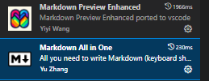

<!-- @import "[TOC]" {cmd="toc" depthFrom=1 depthTo=6 orderedList=false} -->

<!-- code_chunk_output -->

- [1 Install Markdown Extensions](#1-install-markdown-extensions)
  - [Markdown All In One](#markdown-all-in-one)
  - [Markdown Preview Enhanced](#markdown-preview-enhanced)
- [2. Usage](#2-usage)

<!-- /code_chunk_output -->


# 1 Install Markdown Extensions

## Markdown All In One
## Markdown Preview Enhanced




# 2. Usage 
```bash
- Open the Markdown Preview: Ctrl + Shift + V
- Open Markdown: Ctrl + Shift + P / markdown

```