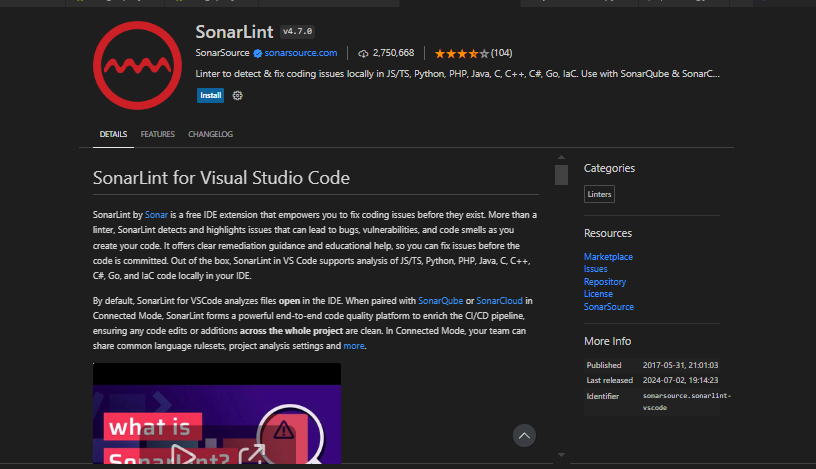

<!-- @import "[TOC]" {cmd="toc" depthFrom=1 depthTo=6 orderedList=false} -->

<!-- code_chunk_output -->

- [Installed sonar-lint](#installed-sonar-lint)

<!-- /code_chunk_output -->

# Installed sonar-lint

[Installation sonar lint](https://marketplace.visualstudio.com/items?itemName=SonarSource.sonarlint-vscode)

